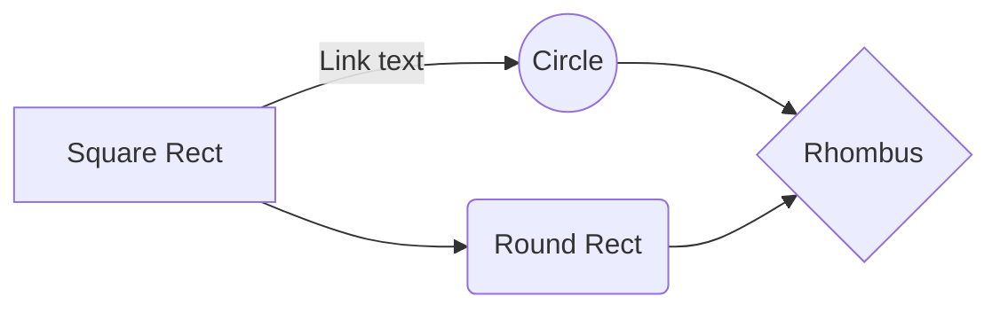
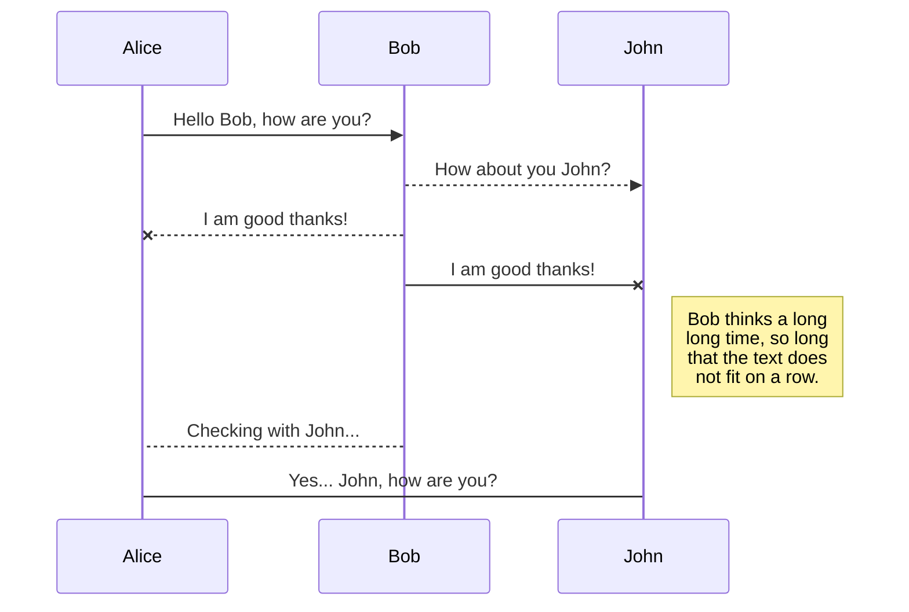
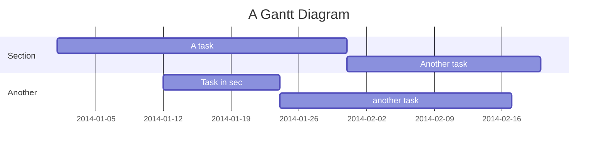
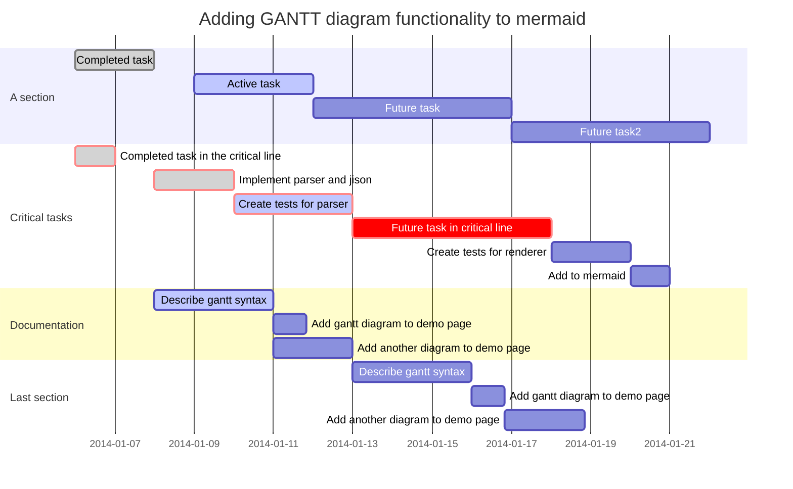

## Mermaid Demos
* docs:  https://mermaidjs.github.io/
* demos: https://mermaidjs.github.io/demos.html
* editor:  https://mermaidjs.github.io/mermaid-live-editor/

### Flowcharts
https://mermaidjs.github.io/flowchart.html

graph top-down

### Sequence Diagrams
https://mermaidjs.github.io/sequenceDiagram.html

### Gantt Diagrams
https://mermaidjs.github.io/gantt.html

